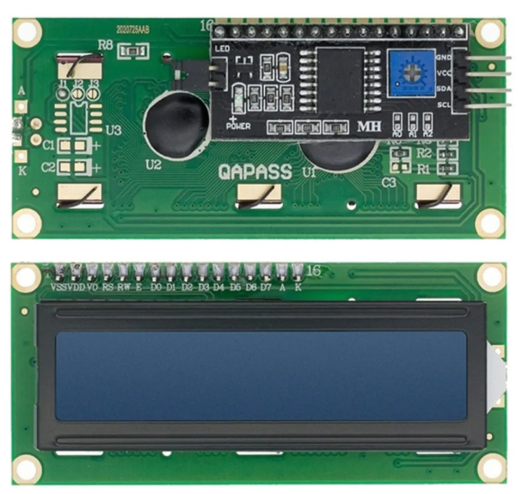

# Overview

This is an example of a low-level device driver from the Zephyr Rust project.

The source code demonstrates how to:

1. Get a pin specification from the [devicetree](https://docs.zephyrproject.org/latest/guides/dts/index.html) as a `gpio_dt_spec`.
2. Configure the GPIO pin as an output.
3. Toggle the LED pins indefinitely.
4. Use interrupt-triggered button control with the `.awake()` construct from the Rust Embassy library.
5. Capture interrupt-driven encoder control using `.awake()` and write data to an I2C (nxp.pcf8574) controlled serial 2x16 (hd44780) LCD display.

# Requirements

Your board must:

1. Have an LED connected via a GPIO pin (often referred to as "User LEDs" on many [Zephyr boards](https://docs.zephyrproject.org/latest/boards/index.html)).
2. Have the LED configured using the `led_x` devicetree alias.
3. Have an encoder connected via GPIO pins.
4. Have an LCD module connected to the `i2cx` pins.

 

# Demo

