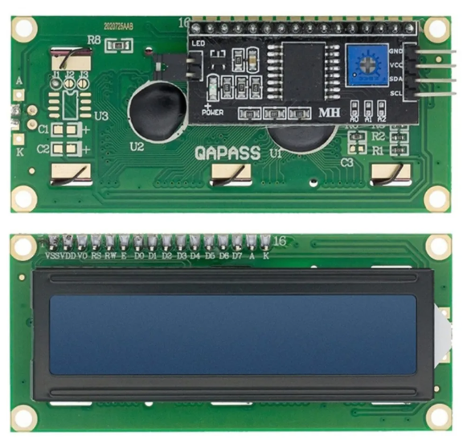

Overview
********

The example of a low level device driver from the Zephyr Rust project.

The source code shows how to:

#. Get a pin specification from the :ref:`devicetree <dt-guide>` as a
   :c:struct:`gpio_dt_spec`
#. Configure the GPIO pin as an output
#. Toggle the led pins forever
#. Interrupt triggered button control using the .awake() construct of the rust embassy library.
#. Also interrupt captured encoder control using the .awake() and write data to the i2c(pcf8574) controlled serial 2x16(hd44780) lcd display.

Requirements
************

Your board must:

#. Have an LED connected via a GPIO pin (these are called "User LEDs" on many of
   Zephyr's :ref:`boards`).
#. Have the LED configured using the ``led_x`` devicetree alias.
#. Have an encoder connected via a GPIO pins.
#. Have an lcd module must be connected to the ``i2cx`` pins.

